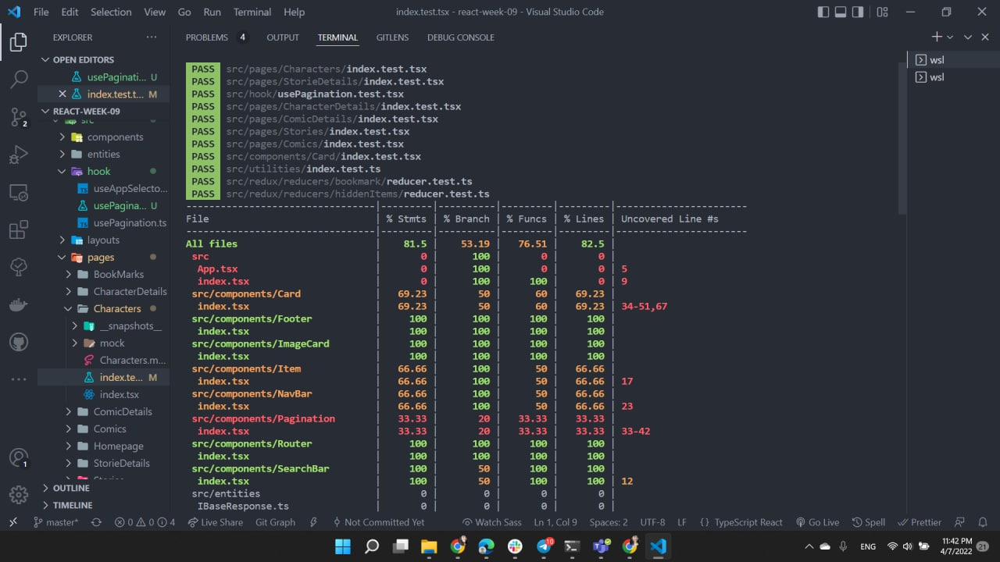
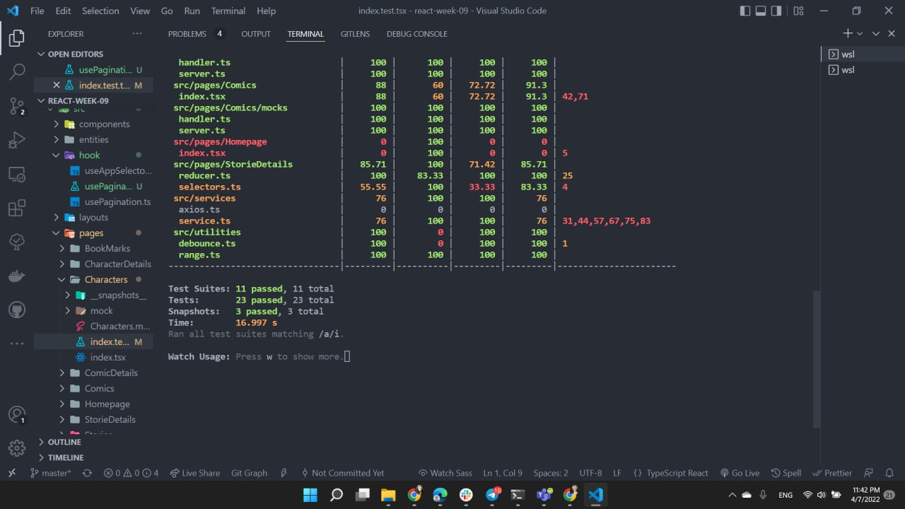

# 
 Testing marvel App 

## What is about?

#### The marvel aApp it's a blog that show the characters, comics and stories of the Marvel World, with the features of searching and filtering the information. Also in this project i applied some special functionalities that make the blog more interesting, the first one is the bookmark section where the user of the app can save the characters and the comics that he or she likes and it shows all the bookmarks in a page, the second functionality is about hidden characters or comics, in the case that the user does not like some of those he or she can hide it and it would not be shown on the lists

## Concepts 
- Redux
- UseState
- Custom Hooks
- Layouts
- React Router

#### _test passed and converage_

#### _test summary_

